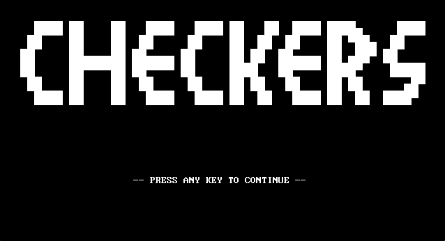

# Checkers Game in 16-Bit MASM Assembly

Welcome to our classic Checkers game, brought to life in 16-bit MASM Assembly! *This project was developed as part of an academic module where the theme was provided by our university.*

## Take Your Pick: GUI or Command Line ️ ⌨️

### Graphical Version:

- **Visually Appealing:** Enjoy a user-friendly interface with beautiful graphics.
- **Interactive Play:** Utilize intuitive mouse controls for a seamless experience.
- **Platform:** Runs flawlessly on DOSBox.

### Command Line Version:

- **Simple and Classic:** Experience the traditional charm of a text-based interface.
- **Keyboard Control:** Navigate the game using familiar keyboard inputs.
- **Compatibility:** Runs primarily on Emu8086 emulator.
## Screenshots
- Graphical Version:
<p align="center">
    
    
</p>

<p align="center">
    
    
</p>


- Command Line Version:

<p align="center">
    
    
    
</p>


## Getting Started

Before you dive into the game, make sure you have the following:

- **DOSBox:** Essential for running the graphical version.
- **Emu8086:** Required for running the command-line version.

### Clone the Repository:

```bash
git clone https://github.com/Daarkooo/checkers-game
```
### Running the Graphical Version:

1. Open DOSBox.
2. Mount the directory containing the graphical version files:
```bash
   mount c /path/to/checkers-game
   c:
```
3. Navigate to the graphical_version directory:
```bash
   cd GUI
```
4. Start the game:
```bash
   checkers.exe
```

## Running the Command Line Version:

1. Open Emu8086 emulator.
2. Open the `checkers.asm` file located in the `CMD` directory.
3. Run the file directly in Emu8086.

## Understanding the Controls:

- **Graphical Version:** Use your mouse to interact with the game pieces and navigate the menus.
- **Command Line Version:** Use specific keyboard keys for controlling pieces and menu navigation.

## Contributors

This project was made possible by the hard work and dedication of the following contributors:

- **Contributor 1:** [Hichem Hireche](https://github.com/Daarkooo)
- **Contributor 2:** [Abderrahim Medjber](https://github.com/MedjberAbderrahim)
- **Contributor 3:** [Rayan Chabati](https://github.com/Rayanch0)
- **Contributor 4:** [Abderaouf Benamirouche](https://github.com/Abdou-bnm)
- **Contributor 5:** [Omar Heriche](https://github.com/OmarHeriche)
- **Contributor 6:** [Ramy Imansoura](https://github.com/Ramy-Dev)

## Contributing to the Project

We'd love your contributions to enhance this checkers game! Here's how you can participate:

1. Fork the repository on GitHub.
2. Create a new branch for your specific changes.
3. Make your modifications to the code.
4. Commit your changes with a clear message describing your contribution.
5. Push your changes to your forked branch.
6. Submit a Pull Request to the main repository.

---

#### Now, let's dive in and enjoy the game!

---


